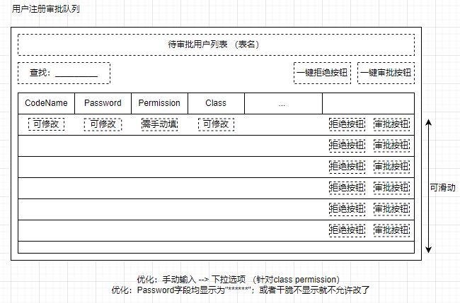
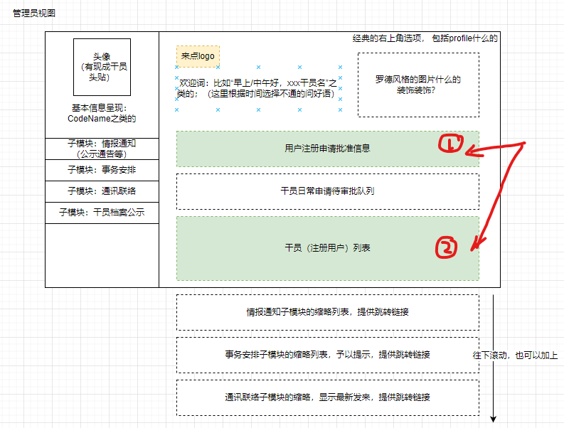

# P.R.T.S.罗德岛管理系统-开发文档

## 目录

- [P.R.T.S.罗德岛管理系统-开发文档](#prts罗德岛管理系统-开发文档)
  - [目录](#目录)
  - [一、工作约定](#一工作约定)
    - [对于开发者xxx](#对于开发者xxx)
    - [对于项目总体](#对于项目总体)
    - [其他](#其他)
  - [二、项目结构](#二项目结构)
    - [构建记录](#构建记录)
    - [运行方法](#运行方法)
      - [启动后端服务器](#启动后端服务器)
      - [启动前端服务器](#启动前端服务器)
  - [三、项目设计](#三项目设计)
    - [1.用户管理系统](#1用户管理系统)
    - [2.登录后主页面：显示内容按权限划分](#2登录后主页面显示内容按权限划分)
    - [3.侧边栏：情报通知模块](#3侧边栏情报通知模块)
    - [4.侧边栏：月度事务安排](#4侧边栏月度事务安排)
    - [5.侧边栏：即时通讯模块](#5侧边栏即时通讯模块)
    - [6.侧边栏：干员档案公示](#6侧边栏干员档案公示)
    - [7.申请表单](#7申请表单)
  - [四、软件依赖](#四软件依赖)
    - [1.图片绘制](#1图片绘制)
    - [2.后端相关](#2后端相关)
    - [3.前端相关](#3前端相关)
      - [依赖的包](#依赖的包)
    - [4.数据库相关](#4数据库相关)

## 一、工作约定

### 对于开发者xxx

- 从dev分支创建自己的分支dev-xxx (`git checkout -b dev-xxx`)
- 在自己的分支dev-xxx上进行开发任务
- 任务到一定阶段，可稳定运行时，同步到dev分支
    - 切换到dev分支，进行pull，同步可能存在的dev更新 (`git checkout dev` + `git pull`)
    - 切换到dev-xxx分支，进行merge操作，将dev分支内容同步到dev-xxx分支 (`git checkout dev-xxx` + `git merge dev`)
    - 切换到dev分支，进行merge操作，将当下的dev-xxx内容同步到dev分支 (`git checkout dev` + `git merge dev-xxx`)
    - 途中可能产生冲突，进行相应处理，遇到可怕问题直接根据提示abort掉该次merge

> 关于为何不直接将dev-xxx合并到dev：算是一层保险吧，虽然其实有合并abort的功能这样稍显多此一举

### 对于项目总体
- master：release版本（或许之后改成stable-date形式，对不同版本进行保存）
- dev：总开发分支，保证其上代码可运行
- dev-xxx：开发人员各自的分支

### 其他
- 由于`/frontend`中`package-lock.json`和`package.json`是中途从库中删除的，所以留下了相应删除的commit记录；为以防合并误删本地内容，事先留备份为好
- commit信息无要求，写清楚可溯源即可
- 代码希望还是能写点注释咩，方便观摩doge

## 二、项目结构

### 构建记录

`/`：根目录；运行`django-admin startproject db-project`得来

`/backend`：后端目录，为django的app；根目录运行`django-admin startapp backend`得来

`/frontend`：前端目录，为vue3项目；根目录运行`npm init vite@latest frontend -- --template vue`得来（具体见“软件本本-后端”部分）

### 运行方法

#### 启动后端服务器
根目录运行`python manage.py runserver`
（若Pycharm有配置，也可直接点击run运行）

#### 启动前端服务器
进入`/frontend`目录运行`npm run dev`

## 三、项目设计

**主题**

明日方舟——罗德岛管理系统。模拟泰拉大陆上一家医药公司（罗德岛）的日常经营模式

**风格基调**

扁平化UI，动画以浮动为主，黑白色调为主辅助亮色点缀

**模块划分**

### 1.用户管理系统

系统登录页面、注册跳转页面

**登录**：CodeName、PassWord 输入与核对，然后根据权限跳转到各自主页面

用户信息表（user_account）
| 数据项名字 | 数据类型 | 约束               | 备注                      |
| ---------- | -------- | ------------------ | ------------------------- |
| CodeName   | char(30) | primary key        | 代号；相当于用户名        |
| Password   | char(20) | not null           |                           |
| Permission | tinyint  | not null, unsigned | 值越小，权限越高；最小为0 |
| Class      | char(20) |                    | 职业分类                  |
| Region     | char(30) |                    | 地区                      |
| Race       | char(20) |                    | 种族                      |
| Avatar     | blob     |                    | 头像                      |
| Mail       | char(20) |                    | 邮件地址                  |

> 关于User信息和Profile是否分两张表，容我再考虑考虑，第一次作业就这样了；之后Profile应该还会有好些项

**注册**：点击"注册"按钮后，跳转至注册页面。填写注册信息（CodeName、PassWord等），然后信息会被接受并填入另一张名为“待审批用户表”，经过管理员审批后会加入“用户信息表”

待审批用户表（account_approve_queue）
| 数据项名字  | 数据类型 | 约束        | 备注               |
| ----------- | -------- | ----------- | ------------------ |
| CodeName    | char(30) | primary key | 代号；相当于用户名 |
| Password    | char(20) | not null    |                   |
| Permission  | tinyint  | unsigned    | 待管理员分配       |
| Class       | char(20) |             | 职业分类           |
| Region      | char(30) |             | 地区               |
| Race        | char(20) |             | 种族               |
| Description | text     |             | 备注               |

> 关于Description：我的想法是，对于某种表的呈现样式，点击“修改按钮”，会弹出一个修改小窗口，其上显示所有项包括Description。不过这样就和下表所画设计有所不同，具体看前端怎么呈现方便怎么来，先扔了这一项也行

**审批**： 审批通过，则将相应信息从“待审批用户表”中删除，转填入“用户信息表”中（对应项，缺少的就为空）；若审批不通过，则直接将相应信息从“待审批用户表”中删去

可能得找找相关的模板代码

> 我这样设想：这张表接受注册界面要求填写的所有内容（**完成增操作**），然后根据这张表的信息在管理员主页上显示“待审批用户列表”。对于每一条申请记录（关系元组），管理员做出审批操作后便从该表中删除（**完成删操作**），同意注册则将相关信息转加入到“用户信息表”中；管理员可通过查找来显示特定CodeName的申请信息(**完成查操作**， 其实登录验证本身就是查操作，倒是无所谓了)

> 关于**改操作**，要不就审批时，每次填写、修改信息就对待“审批用户表”做一次修改好了

拓展：
- 验证码
- （如果有空的话）希望刚进页面时有一个动画，登录连接成功后有一个动画（类似[明日方舟官网](https://ak.hypergryph.com/)的效果）
- 邮箱，邮箱的激活认证，审批通过/不通过进行邮箱通知

### 2.登录后主页面：显示内容按权限划分

基本信息呈现。

----
**目前的TODO**：
管理员视图下的①和②（可以加一个②，只呈现“用户信息表”的内容做一个动态的参照）

----

管理员(`Permission == 0 || Permission == 1`)

普通干员

### 3.侧边栏：情报通知模块

呈现通知、公告、表彰等一些列舰船内公关内容

管理员、授权用户组（比如凯太后）可编辑内容，类似于博客文章系统，提供支持markdown的编辑器；普通用户（一般干员）可留言评论

舰船航行位置（地图上标示）

各地办事处联络情报：卡西米尔、哥伦比亚、莱塔尼亚、龙门、尚蜀、伊比利亚、叙拉古...

干员借调公示：黑钢、莱茵生命

活动安排：日落即逝驻场演出、迎新会

### 4.侧边栏：月度事务安排

基础事务 + 委托事务

做一个月度日历，其上标示各种事项

资源采购

源石抑制剂、药物出口安排

手术排班（针对医疗干员们）

博士助理安排

基建管理：副手、制造站、贸易站、发电站、训练室

宿舍管理

食堂菜品公式（提供留言区）

### 5.侧边栏：即时通讯模块

可选择单独干员、干员组进行联络，简易版微信功能

### 6.侧边栏：干员档案公示

（解释：干员之间互相了解最直接的方式）

根据不同权限，显示不同详细程度的内容；各管理员可对内容进行些许评论

### 7.申请表单

申请研究经费、外勤、假期、训练室之类的

采购中心

## 四、软件依赖

### 1.图片绘制
通过[网页drawio编辑器](https://app.diagrams.net/)画出，在`document/`中有源文件可修改，生成的图（或者截图）放在`document/images/`中

### 2.后端相关
> 包都是pip安装，`pip list`即可查看所有版本情况

- python 3.10.6
- pip 22.2.1
- django 4.1.1 （根据官网提示下载的，`pip install Django==4.1.1`；`python -m django --version`查看）
- djangorestframework 3.14.0
- markdown  3.4.1
- django-filter 22.1
- djangorestframework-jwt 1.11.0 （rest_framework_jwt模块，`pip install djangorestframework-jwt`）
- django-cors-headers 3.13.0 （后端用于解决跨域问题，不过应该没用上）

### 3.前端相关

- node.js v16.17.0 （官网下载的包再添加环境变量；`node -v`查看）
- npm 8.15.0 （node.js的包管理软件，应该自带；`npm -v`查看）
- cnpm （按菜鸟教程所说使用cnpm，[使用淘宝 NPM 镜像](https://www.runoob.com/nodejs/nodejs-npm.html#taobaonpm)）
- vue 3.2.39 （应该是使用`cnpm install vue@next`装的vue3；`npm list vue`查看）
- vite 3.1.3（新型前端构建工具，pycharm终端输入`npm init vite@latest frontend -- --template vue`，按提示安装`create-vite@latest`，再按提示完成`cd frontend`、`npm install`即安装完毕，`vite -v`查看）

#### 依赖的包
- element-plus(`npm install element-plus --save`)
- icon(`npm install @element-plus/icons-vue`)
- router(`npm install vue-router@4`)
- VueUse(`npm i @vueuse/core @vueuse/components`)
- axios(`npm install axios@0.26.1`)
- universal-cookie(`npm i universal-cookie`)
- integrations(`npm i @vueuse/integrations`)
- vuex(`npm install vuex@next --save`)
- windicss(`npm i -D vite-plugin-windicss windicss`)
- qs(`npm install qs`)
- reactivity(`npm install @vue/reactivity`)

### 4.数据库相关

- MySQL: 装了一堆，主要的都是8.0 

