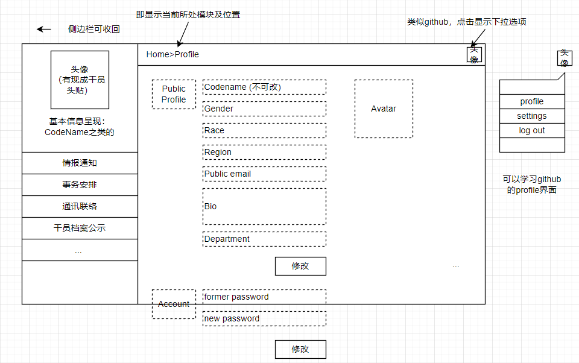
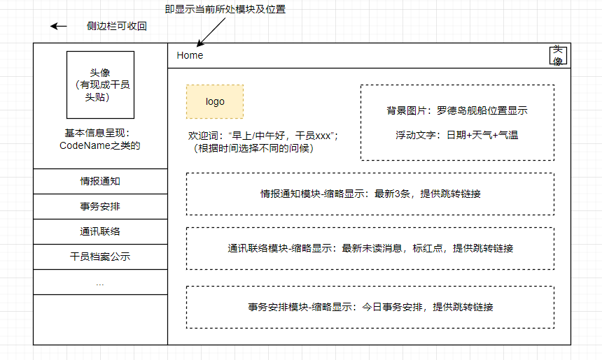
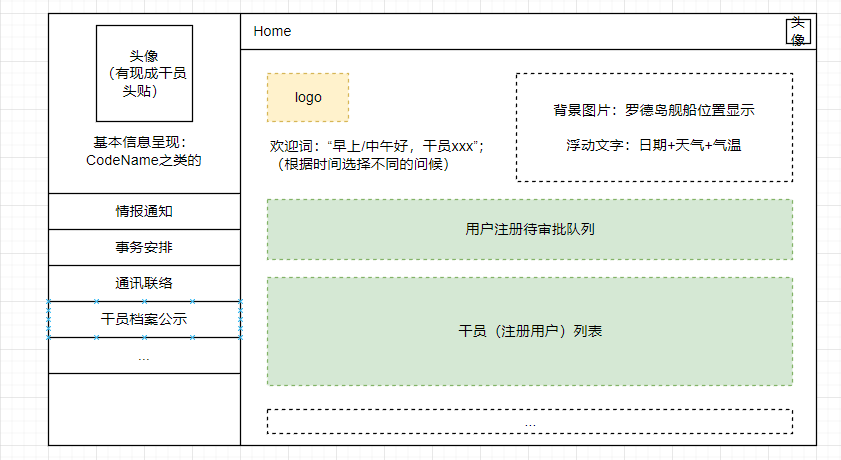
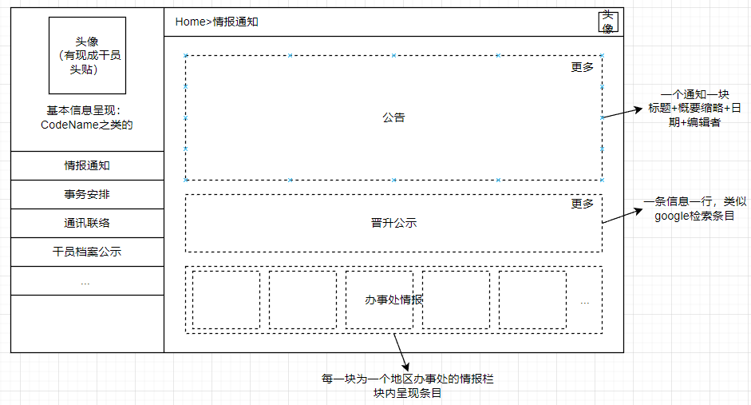
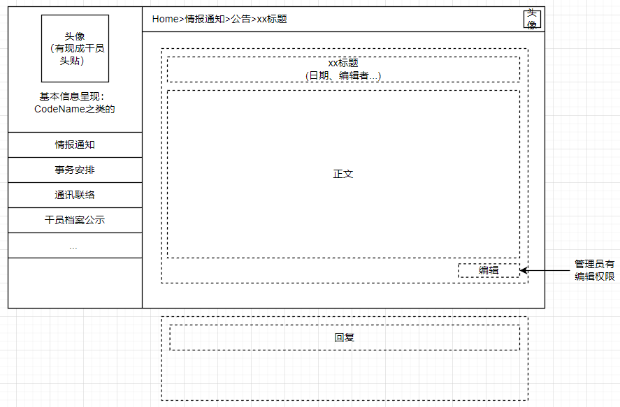
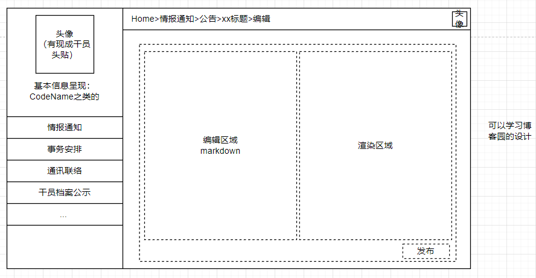
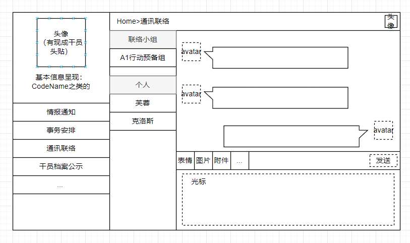

# P.R.T.S.罗德岛管理系统-开发文档

## 目录

- [P.R.T.S.罗德岛管理系统-开发文档](#prts罗德岛管理系统-开发文档)
  - [目录](#目录)
  - [一、工作约定](#一工作约定)
    - [1.对于开发者xxx](#1对于开发者xxx)
    - [2.对于项目总体](#2对于项目总体)
    - [3.其他](#3其他)
  - [二、项目结构](#二项目结构)
    - [1.构建记录](#1构建记录)
    - [2.运行方法](#2运行方法)
      - [启动后端服务器](#启动后端服务器)
      - [启动前端服务器](#启动前端服务器)
  - [三、项目设计](#三项目设计)
    - [1.用户管理系统](#1用户管理系统)
      - [（1）布局设计](#1布局设计)
      - [（2）数据表定义](#2数据表定义)
      - [（3）功能描述](#3功能描述)
      - [（4）预期拓展](#4预期拓展)
    - [2.用户主页面](#2用户主页面)
      - [（1）布局设计](#1布局设计-1)
      - [（2）数据表定义](#2数据表定义-1)
      - [（3）功能描述](#3功能描述-1)
      - [（4）预期拓展](#4预期拓展-1)
    - [3.子模块-情报通知](#3子模块-情报通知)
      - [（1）布局设计](#1布局设计-2)
      - [（2）数据表定义](#2数据表定义-2)
      - [（3）功能描述](#3功能描述-2)
      - [（4）预期拓展](#4预期拓展-2)
    - [4.子模块-事务安排](#4子模块-事务安排)
      - [（1）布局设计](#1布局设计-3)
      - [（2）数据表定义](#2数据表定义-3)
      - [（3）功能描述](#3功能描述-3)
      - [（4）预期拓展](#4预期拓展-3)
    - [5.子模块-即时通讯模块](#5子模块-即时通讯模块)
      - [（1）布局设计](#1布局设计-4)
      - [（2）数据表定义](#2数据表定义-4)
      - [（3）功能描述](#3功能描述-4)
      - [（4）预期拓展](#4预期拓展-4)
    - [6.侧边栏：干员档案公示](#6侧边栏干员档案公示)
    - [7.申请表单](#7申请表单)
  - [四、软件依赖](#四软件依赖)
    - [1.图片绘制](#1图片绘制)
    - [2.后端相关](#2后端相关)
    - [3.前端相关](#3前端相关)
      - [依赖的包](#依赖的包)
    - [4.数据库相关](#4数据库相关)

## 一、工作约定

### 1.对于开发者xxx

- 从dev分支创建自己的分支dev-xxx (`git checkout -b dev-xxx`)
- 在自己的分支dev-xxx上进行开发任务
- 任务到一定阶段，可稳定运行时，同步到dev分支
    - 切换到dev分支，进行pull，同步可能存在的dev更新 (`git checkout dev` + `git pull`)
    - 切换到dev-xxx分支，进行merge操作，将dev分支内容同步到dev-xxx分支 (`git checkout dev-xxx` + `git merge dev`)
    - 切换到dev分支，进行merge操作，将当下的dev-xxx内容同步到dev分支 (`git checkout dev` + `git merge dev-xxx`)
    - 途中可能产生冲突，进行相应处理，遇到可怕问题直接根据提示abort掉该次merge

> 关于为何不直接将dev-xxx合并到dev：算是一层保险吧，虽然其实有合并abort的功能这样稍显多此一举

### 2.对于项目总体
- master：release版本（或许之后改成stable-date形式，对不同版本进行保存）
- dev：总开发分支，保证其上代码可运行
- dev-xxx：开发人员各自的分支

### 3.其他
- 由于`/frontend`中`package-lock.json`和`package.json`是中途从库中删除的，所以留下了相应删除的commit记录；为以防合并误删本地内容，事先留备份为好
- commit信息无要求，写清楚可溯源即可
- 每次dev分支有代码性更新时，请务必**即时将其merge到自己的分支**，然后再在此基础上进行开发
- 代码希望还是能写点注释咩，方便观摩doge

## 二、项目结构

### 1.构建记录

`/`：根目录；运行`django-admin startproject db-project`得来

`/backend`：后端目录，为django的app；根目录运行`django-admin startapp backend`得来

`/frontend`：前端目录，为vue3项目；根目录运行`npm init vite@latest frontend -- --template vue`得来（具体见“软件本本-后端”部分）

### 2.运行方法

#### 启动后端服务器
根目录运行`python manage.py runserver`
（若Pycharm有配置，也可直接点击run运行）

#### 启动前端服务器
进入`/frontend`目录运行`npm run dev`

## 三、项目设计

**主题**

明日方舟——罗德岛管理系统。模拟泰拉大陆上一家医药公司（罗德岛）的日常经营模式

**风格基调**

扁平化UI，动画以浮动为主，黑白色调为主辅助亮色点缀

**模块划分**

### 1.用户管理系统

系统登录页面、注册跳转页面，用户信息的记录、修改与验证

#### （1）布局设计

登录与注册界面已完成在此不表；

用户修改自己profile信息的界面初步UI设计如下：

#### （2）数据表定义

**用户信息表（user_account）**

| 数据项名字 | 数据类型 | 约束               | 备注                      |
| ---------- | -------- | ------------------ | ------------------------- |
| CodeName   | char(30) | primary key        | 代号；相当于用户名        |
| Password   | char(20) | not null           |                           |
| Permission | tinyint  | not null, unsigned | 值越小，权限越高；最小为0 |
| Mail       | char(20) |                    | 邮件地址                  |

**用户资料表（user_profile）**

| 数据项名字 | 数据类型 | 约束        | 备注               |
| ---------- | -------- | ----------- | ------------------ |
| CodeName   | char(30) | primary key | 代号；相当于用户名 |
| Gender     | tinyint  |             | 性别（二值）       |
| Class      | char(20) |             | 职业分类           |
| Region     | char(30) |             | 地区               |
| Race       | char(20) |             | 种族               |
| Avatar     | blob     |             | 头像               |
| Bio        | tinytext |             | 自述               |

**待审批用户表（account_approve_queue）**

| 数据项名字  | 数据类型 | 约束        | 备注               |
| ----------- | -------- | ----------- | ------------------ |
| CodeName    | char(30) | primary key | 代号；相当于用户名 |
| Password    | char(20) | not null    |                    |
| Permission  | tinyint  | unsigned    | 待管理员分配       |
| Gender      | tinyint  |             |                    |
| Class       | char(20) |             | 职业分类           |
| Region      | char(30) |             | 地区               |
| Race        | char(20) |             | 种族               |
| Description | text     |             | 备注               |

#### （3）功能描述

**登录**：CodeName、PassWord 输入与核对，然后根据权限跳转到各自主页面

**注册**：点击"注册"按钮后，跳转至注册页面。填写注册信息，提交后被直接填入“待审批用户表”，经过管理员修改审批后加入“用户信息表”

**审批**：审批通过，则将相应信息从“待审批用户表”中删除，转填入“用户信息表”中（对应项，缺少的就为空）；若审批不通过，则直接将相应信息从“待审批用户表”中删去

**修改**：该功能为用户登录后功能。类似github或其他网站的用户自我修改操作，进行`公开资料修改`和`用户密码修改`，分别操纵”用户信息表“和”用户资料表“

> 关于user_account 和 user_profile 分表的必要性，目前似乎还是必要的，还可讨论

#### （4）预期拓展

- 实现验证码；
- 刚进页面时有一个动画，登录连接成功后有一个动画（类似[明日方舟官网](https://ak.hypergryph.com/)的效果）；
- 注册时邮箱的激活认证，审批通过/不通过进行邮箱通知；

### 2.用户主页面

用户登录后自动转入的界面，按权限呈现相应基本信息和引导

#### （1）布局设计

基本布局如下：

若用户为管理员（`Permission <= 1`）,则增加一些显示内容

#### （2）数据表定义

无对应新数据表

#### （3）功能描述

基本的系统引导，基本内容见布局设计，未定

#### （4）预期拓展

- 干员出勤、请假、活动、研究审批功能：干员提交申请表单+管理员审核批准

### 3.子模块-情报通知

显示公告、晋升公示、办事处情报

#### （1）布局设计

主页

>  文章的类别设定仍待考量

文章展示

文章编辑

#### （2）数据表定义

**文章实体表（passage）**

| 数据项名字   | 数据类型  | 约束                  | 备注                               |
| ------------ | --------- | --------------------- | ---------------------------------- |
| PId          | int       | primary key           | 文章编号                           |
| Title        | char(45)  | not null              | 标题（15个中文字）                 |
| Poster       | char(30)  | not null, foreign key | 发布者（CodeName）                 |
| PostDate     | timestamp | not null              | 发布时间                           |
| LastEditor   | char(30)  | not null, foreign key | 最后编辑者（CodeName）             |
| LastEditTime | timestamp | not null              | 最后编辑时间                       |
| Content      | text      | not null              | 内容，64KB（21845个中文字）        |
| Type         | tinyint   | not null              | 文章类别：公告、晋升公示、地区情报 |

此处的Type属性是为了区别文章的类别，是否需要如上课所说将其优化为3个子表呢，有待考量

**回复实体表（reply）**

| 数据项名字  | 数据类型 | 约束                  | 备注                  |
| ----------- | -------- | --------------------- | --------------------- |
| RId         | int      | primary key           | reply编号             |
| Replier     | char(30) | not null, foreign key | 回复者（CodeName）    |
| AttachedPId | int      | not null, foreign key | 依附的文章编号（PId） |
| Content     | tinytext | not null              |                       |

删除notice会导致依附的reply一起被删，此处打算建一个触发器，在删除某条notice前，检索reply并删除`AttachedNId = NId`的数据

#### （3）功能描述

管理员用户可发布、编辑、删除文章；所有用户均可阅读、回复文章。文章和回复的编辑支持markdown。

- 公告主题内容：近期重大事件、研究进展、公司合作与干员借调（黑钢、莱茵、喀兰...）、岛内活动安排（迎新、演唱会...）

- 晋升公示内容：模式比较固定。某干员

- 办事处地区：参考Region列表（不过地区的级别应该不为国家，而是国家下属的地区）

#### （4）预期拓展

暂无

### 4.子模块-事务安排

基础事务惯例安排 + 委托事务的发布接取

#### （1）布局设计

#### （2）数据表定义

#### （3）功能描述

做一个月度日历，其上标示各种事项

资源采购

源石抑制剂、药物出口安排

手术排班（针对医疗干员们）

博士助理安排

基建管理：副手、制造站、贸易站、发电站、训练室

宿舍管理

食堂菜品公式（提供留言区）

#### （4）预期拓展

### 5.子模块-通讯联络

模仿微信功能，实现网页版聊天室功能。即干员选择与干员、干员组进行即时联络

#### （1）布局设计

#### （2）数据表定义

**消息实体表（message)**

| 数据项名字   | 数据类型  | 约束                  | 备注               |
| ------------ | --------- | --------------------- | ------------------ |
| MId          | int       | primary key           | message编号        |
| Type         | tinyint   | not null              | 对个人-0；对群组-1 |
| SendFrom     | char(30)  | not null, foreign key | 发送方             |
| SendToPerson | char(30)  | foreign key           | 接收个人           |
| SendToGroup  | int       | foreign key           | 接收群组           |
| ContentText  | tinytext  | not null              | 消息文本           |
| Picture      | blob      |                       | 图像信息           |
| Time         | timestamp | not null              | 发布时间           |

**群组实体表（group）**

| 数据项名字 | 数据类型  | 约束                  | 备注                       |
| ---------- | --------- | --------------------- | -------------------------- |
| GId        | int       | primary key           | group编号                  |
| GName      | char(30)  | not null              | group名                    |
| Owner      | char(30)  | not null, foreign key | 群主，初建为创建该群的干员 |
| BornTime   | timestamp | not null              | 群组创建时间               |
| GSize      | int       |                       | 成员数量                   |
|            |           |                       |                            |

**用户-群组关系表（operator_group）**

| 数据项名字 | 数据类型 | 约束                     | 备注                   |
| ---------- | -------- | ------------------------ | ---------------------- |
| GId        | int      | primary key, foreign key | group编号              |
| CodeName   | char(30) | primary key, foreign key | 干员名称，得是已有用户 |
| isOwner    | tinyint  |                          | 是否是群组             |

#### （3）功能描述

包含所需接口

- 添加群组（addGroup）: 
  - 需要获取所有干员的名称列表（为了呈现创建时的表单，GET）
  - 前端返回群组名和群成员名（完成创建，需要插入到”用户-群组关系表“中，）
- 消息相关（sendMessage）：
  - 需要获取某指定群组中所有的消息，并按时间顺序排列（用于显示群组消息内容、历史，从“消息实体表”中，**同时需要发送方的avatar，从用户资料表中获取**）
  - 发送消息，前端返回一条消息的完整内容，填入“消息实体表”中

#### （4）预期拓展

- 消息包含 图像、附件

### 6.侧边栏：干员档案公示

（解释：干员之间互相了解最直接的方式）

根据不同权限，显示不同详细程度的内容；各管理员可对内容进行些许评论

### 7.申请表单

申请研究经费、外勤、假期、训练室之类的

采购中心

## 四、软件依赖

### 1.图片绘制
通过[网页drawio编辑器](https://app.diagrams.net/)画出，在`document/`中有源文件可修改，生成的图（或者截图）放在`document/images/`中

### 2.后端相关
> 包都是pip安装，`pip list`即可查看所有版本情况

- python 3.10.6
- pip 22.2.1
- django 4.1.1 （根据官网提示下载的，`pip install Django==4.1.1`；`python -m django --version`查看）
- djangorestframework 3.14.0
- markdown  3.4.1
- django-filter 22.1
- djangorestframework-jwt 1.11.0 （rest_framework_jwt模块，`pip install djangorestframework-jwt`）
- django-cors-headers 3.13.0 （后端用于解决跨域问题，不过应该没用上）

### 3.前端相关

- node.js v16.17.0 （官网下载的包再添加环境变量；`node -v`查看）
- npm 8.15.0 （node.js的包管理软件，应该自带；`npm -v`查看）
- cnpm （按菜鸟教程所说使用cnpm，[使用淘宝 NPM 镜像](https://www.runoob.com/nodejs/nodejs-npm.html#taobaonpm)）
- vue 3.2.39 （应该是使用`cnpm install vue@next`装的vue3；`npm list vue`查看）
- vite 3.1.3（新型前端构建工具，pycharm终端输入`npm init vite@latest frontend -- --template vue`，按提示安装`create-vite@latest`，再按提示完成`cd frontend`、`npm install`即安装完毕，`vite -v`查看）

#### 依赖的包
- element-plus(`npm install element-plus --save`)
- icon(`npm install @element-plus/icons-vue`)
- router(`npm install vue-router@4`)
- VueUse(`npm i @vueuse/core @vueuse/components`)
- axios(`npm install axios@0.26.1`)
- universal-cookie(`npm i universal-cookie`)
- integrations(`npm i @vueuse/integrations`)
- vuex(`npm install vuex@next --save`)
- windicss(`npm i -D vite-plugin-windicss windicss`)
- qs(`npm install qs`)
- reactivity(`npm install @vue/reactivity`)
- v-md-editor(`npm i @kangc/v-md-editor@next -S` \[谢邀，`mavonEditor`看起来不支持vue3呢(哭)\])
- mitt（`npm i mitt`，事件总线EventBus的vue3版）

### 4.数据库相关

- MySQL: 装了一堆，主要的都是8.0 

